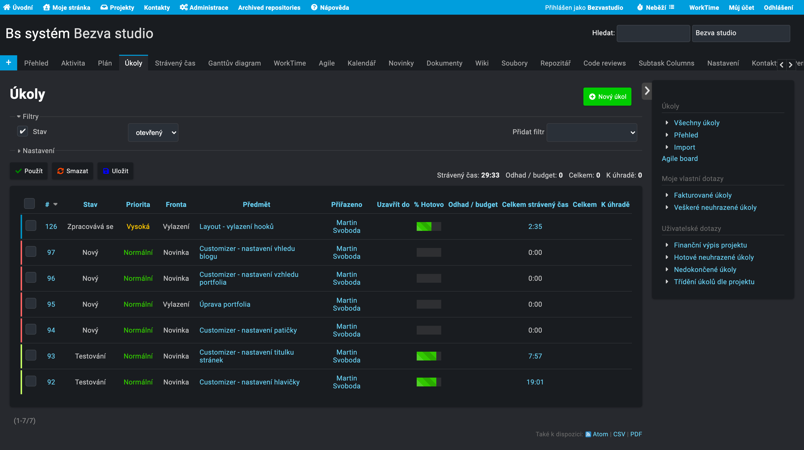

BS Redmine theme light
==============

Light and modern template for Redmine based on material design.



Tested on:
- Redmine version                3.4.10.stable
- Ruby version                   2.3.3-p222 (2016-11-21) [x86_64-linux-gnu]
- Rails version                  4.2.11.1

## Installation

### Install theme

1. Download from https://github.com/Bezvastudio/bs-redmine-theme-light
1. Move to `redmine/public/theme/`

Or by using git:

```
cd redmine/public/theme
git clone https://github.com/Bezvastudio/bs-redmine-theme-light.git
```

### Change theme

1. Open your redmine on a browser
1. Login as admin user
1. Go to ``Administration > Settings > Display``
1. Select ``bs-redmine-theme-light`` on ``Theme``


## License

GNU General Public License (GPL) Version 2

## Suported plugins
The template also modifies the basic appearance of the following plugins

#Redmine Agile plugin (Light version)
Scrum and Agile project management plugin for redmine
http://redmineup.com/pages/plugins/agile

#Redmine - Smile - Hide / Show Sidebar Button
Adds a button to hide / show the right sidebar
https://github.com/Smile-SA/redmine_smile_togglesidebar

#Redmine Work Time plugin
A plugin to view and update TimeEntry by each user
http://www.redmine.org/plugins/redmine_work_time

#Redmine WYSIWYG Editor plugin
Redmine WYSIWYG text editor
https://github.com/taqueci/redmine_wysiwyg_editor
